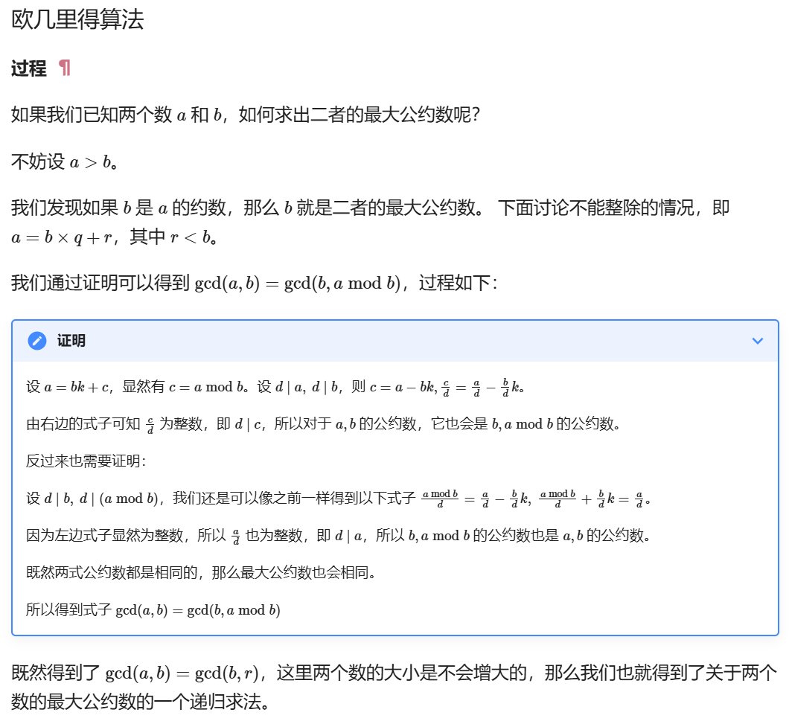

# RSA

##### 数据类型互转:pip install pycryptodome

long_to_bytes()整型转字节

butes_to_long()字节转整型

isPrime()判断素数

getPrime()获得指定位数的素数

##### 数学相关gmpy2:pip install gmpy2

gmpy2.mpz()大整数

powmod()带模数的指数运算

invert()求逆元，如e\*d=1 mod phi（即e * d mod phi = 1 ）

gcd()公约数

lcm()公倍数

gcdext()扩展公约数

iroot()开N次根（可开不尽）

### pq接近

用iroot(n,2)开2次根，得出的结果是q，p中的小者，nextpirme得出大的数

### dp泄露

dp=d%(p-1)即有dp=d-k1*(p-1)

根据d的定义有e*d = 1 mod (p-1)\*(q-1)

### Rabin

条件：p % 4 = 3 , q % 4 = 3

特征：e=2

### pq为大质数，N = p^2*q


### 威尔逊定理

出现阶乘

### 费马小定理：a^(p-1) = 1 mod p 

特征：(p-1)次方或p次方

两道例题解析：[费马小定理的两道ctf题目 [祥云杯2022 little little fermat\]_c1 = (pow(k1,b1,n)*flag)%n c2 = (pow(k1,b2,n)*flag-CSDN博客](https://blog.csdn.net/jayq1/article/details/131931855)

step1：找出能运用费马小定理的公式

step2：两边模p化简，一般情况下有一边有k*n，而n=p\*q所以能直接约掉

step3：用gmpy2.gcd()求出两边的公约数，公约数一般与p或q有关。

如果两边的数都很大，可以用gcd(a,a mod b)来提高效率。gcd(a,b)=gcd(a,a mod b)



### 方程与方程组

sympy中有定义

定义方程的变量：x=Symbol("x")

方程表达式：exp1=x+y-12345

​		       exp2=x*x+y\*y+2\*y\*x-123

方程的解：result=solve((exp1,exp2),[x,y])

​		无解，result为空

​		有解，result为列表，列表元素是字典类型

#### sagemath

sage定义

```
R.<X> = PolynomialRing(Zmod(n))
#Zmod(n):指定模，定义界限为n的环；Z表示整数；指定模是划定这个环的界限，就是有效的数字只有从0到n，其他的都通过与n取模来保证在0～n这个范围内；Zmod代表这是一个整数域中的n模环
#ZZ：整数环；QQ：有理数环；RR：实数环；CC：复数环
#R：只是一个指针，指向用polynomialring指定的那个环（可以使用任意字符）
#PolynomialRing：这个就是说建立多项式环
#.<X>：指定一个变量的意思（可以用任意字符）
```
