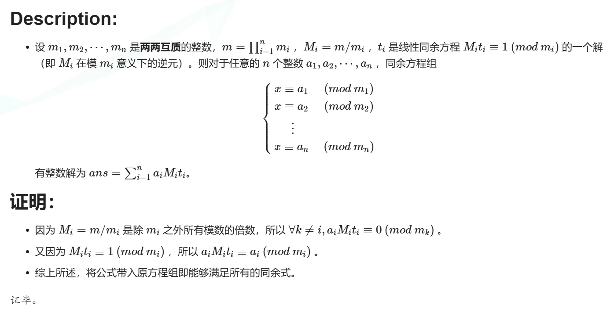

# 中国剩余定理


```
#利用中国剩余定理求解同余方程，aList：余数，mList：模数
def CRT(aList, mList):
    M = 1
    for i in mList:
        M = M * i   #计算M = ∏ mi
    #print(M)
    x = 0
    for i in range(len(mList)):
        Mi = M // mList[i]   #计算Mi
        Mi_inverse = gmpy2.invert(Mi, mList[i]) #计算Mi的逆元
        x += aList[i] * Mi * Mi_inverse #构造x各项
    x = x % M
    return x
 x即 m^e
```

接下来使用gmpy2.iroot()遍历次方根来解出m



